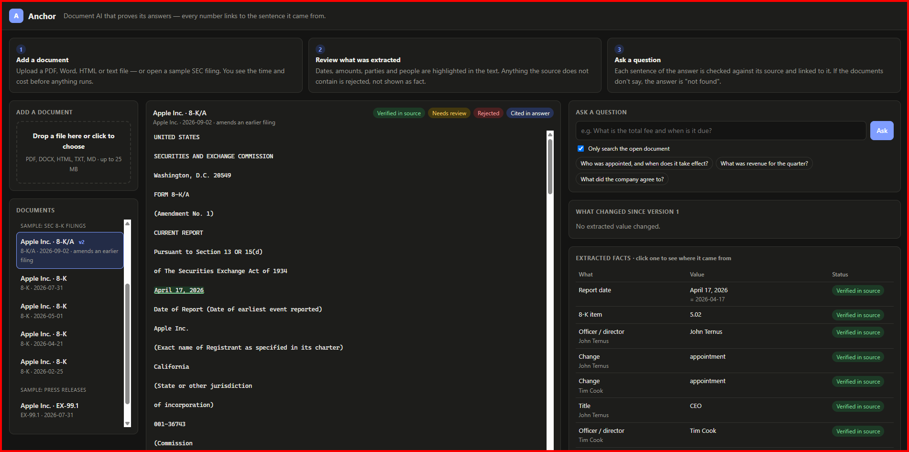

# Anchor

[](https://github.com/nodirbekpm/traceable-rag/actions/workflows/ci.yml)



**Traceable RAG over documents.** Every extracted value and every cited claim
points back to an exact character span in the source document — and anything
that cannot be traced is not shown.

Most document-AI systems treat model output as plain text. Anchor treats it as
evidence: it has a source, a version, a confidence and a measured accuracy.

| Guarantee | What it means in practice |
|---|---|
| **Provenance** | A value that cannot be located in the source is stored as `hallucinated`, never `verified`, and never reaches an answer. The database itself refuses a `verified` fact without a span. |
| **Versioning** | Nothing is deleted. A re-extraction or an amended filing (`8-K/A`) retires old values and links them to their replacement, so "what was this number six months ago, and why did it change?" always has an answer. |
| **Measurement** | Accuracy, citation correctness, refusal rate, latency and cost are numbers from a gold set — including the targets that were missed. |

Works on **any document you upload** — PDF, Word, HTML, text or Markdown — and ships with
SEC EDGAR `8-K` / `8-K/A` filings as a reproducible demo and evaluation corpus.

## Quick start

Requires Docker. Nothing else needs to be installed.

```bash
cp .env.example .env     # set EDGAR_USER_AGENT and GEMINI_API_KEY (free key)
docker compose up -d --build
```

Then fetch, extract, index and ask:

```bash
docker compose run --rm api python -m anchor.ingest --cik 320193 --limit 5   # Apple
docker compose run --rm api python -m anchor.extract
docker compose run --rm api python -m anchor.index
curl -N "localhost:8000/ask?q=Who+did+Apple+appoint+as+CEO"
```

Open **http://localhost:8000** for the viewer: the document on the left with
extracted values highlighted by status, answers on the right; clicking a value
or a citation scrolls to its exact span and shows model, versions and history.

Every command is idempotent: running it again downloads, extracts or embeds
nothing that is already there.

### Your own documents

Drop a file on the viewer (or `POST /documents`). Nothing runs yet: Anchor first
answers *what will this cost?* — pages, words, model calls, **seconds** and dollars,
estimated from this installation's own past runs. Confirm, and the analysis runs in
the background with a progress bar; long files are read in parts, and every value
still gets an exact span in the full document. Uploaded documents use a general
field set (dates, amounts, parties, people, percentages, deadlines, durations).

| Endpoint | Purpose |
|---|---|
| `POST /documents` | upload; returns the document and the estimate |
| `POST /documents/{id}/analyze` | start extraction and indexing in the background |
| `GET /documents/{id}/status` | progress: queued, extracting, indexing, ready, failed |
| `GET /ask?q=…&document_id=…` | ask, optionally limited to one document |
| `POST /documents/{id}/versions` | upload an edited file as the next version |
| `GET /documents/{id}/changes` | values changed, added or removed since the previous version |
| `DELETE /documents/{id}` | delete an upload with all its versions (filings cannot be deleted) |

Edit a contract and upload it again: the old version and every value it held stay
in the history, each linked to the value that replaced it, and the viewer shows
exactly what changed (`$84,000 → $90,000`).

## Architecture

```
EDGAR API ──► fetcher ──► raw bytes (content-addressed, SHA-256) ──► source_document
                                   │
                       deterministic HTML → text (versioned)
                     ┌─────────────┴──────────────┐
                     ▼                            ▼
          extractor (LLM, JSON)             chunker ×3 strategies
          value + verbatim quote                  │
                     │                      local embeddings (CPU)
          validator: locate quote,                │
          normalize, range, confidence      pgvector HNSW + tsvector GIN
                     │                            │
     verified / needs_review / hallucinated       │
                     ▼                            ▼
             extracted_fact ◄── versioning ──► chunk
           (is_current, superseded_by)            │
                                                  ▼
                       question ─► hybrid retrieval (RRF) ─► rerank ─► LLM
                                                  │
                         per-claim citation check ─► SSE stream ─► viewer
                                                  │
                               Redis cache · query_log · eval harness
```

Stack: Python 3.12 · FastAPI · PostgreSQL 17 + pgvector · SQLAlchemy 2 + Alembic ·
Pydantic v2 · Redis · Gemini (any provider behind one interface) · fastembed
(ONNX, CPU) · Docker Compose · pytest · GitHub Actions.

## How provenance works

1. Raw HTML is converted to plain text by a deterministic, versioned function.
   Every span is a pair of character offsets into that text; raw bytes are kept
   unchanged, so the text can be rebuilt at any time.
2. The model returns each value with a **verbatim quote** that contains it. It
   is never asked for offsets — models miscount characters.
3. The validator finds the quote in the real text, then the value inside the
   quote. Found: the fact gets its span. Not found: `hallucinated`, no span.
4. Values are normalized (`$4.2M`, `4,200,000 USD`, `4.2 million dollars` →
   `4200000 USD`), range-checked, and sent to a review queue when confidence is low.

Each extraction run records model, provider build, prompt, schema and text
versions, tokens and list-price cost.

## How versioning works

- **Idempotency.** A document is extracted once per (model, prompt, schema, text
  version) — enforced by a partial unique index, not just by code.
- **Re-extraction.** A new version key creates a new run; its facts become
  current and the previous ones stay as history, each pointing at its replacement.
- **Amendments.** An `8-K/A` names the filing it amends by date. Anchor links
  the two (`supersedes_id`) and retires only the facts the amendment restates.
  An amendment fact that failed verification never displaces a verified one.
  Tested on a real pair: Apple's April 2026 CEO-transition 8-K and its September 8-K/A.
- **New versions of an upload.** A new version replaces the old one as a whole: every
  value of the old version becomes history; restated values link to their successor.
  Matching falls back from (field, label) to (field, value), because models label the
  same value differently between runs — measured in [decision 005](docs/decisions/005-upload-versions-and-deletion.md).
- **History.** `GET /facts/{id}/history` walks back through every earlier value.
- **Deletion.** Only a user's own upload can be deleted (all versions, values, chunks and
  the stored file). Filings are an audit trail and cannot be deleted.

## How answers are checked

1. Hybrid retrieval (vector + keyword, fused with reciprocal rank fusion) returns
   candidates; a local cross-encoder keeps the best six.
2. The model answers as one JSON line per claim: claim, source, verbatim quote.
3. Each line is checked the moment it completes: the quote must be in the cited
   chunk and every number in the claim must be in the quote. Passing claims are
   streamed immediately with document-level offsets; failing ones are dropped.
4. If nothing passes, the answer is "not found" — a measured behaviour, not an error.

## Evaluation

```bash
docker compose run --rm api python -m anchor.evals prepare   # separate eval database
docker compose run --rm api python -m anchor.evals run       # all three suites
```

The gold set lives in [`evals/golden`](evals/golden): **36 real filings** from
ten companies, **147 annotated fields**, **62 answerable and 10 unanswerable
questions**. Every gold quote is located in the source text, so provenance and
citations are scored by span overlap rather than string similarity.

| Suite | Metrics |
|---|---|
| Extraction | field accuracy, provenance correctness, wrong-value rate, hallucination rate, cost and time per document |
| Retrieval | recall@5, recall@10, MRR for vector / keyword / hybrid × three chunking strategies, plus reranking |
| Answers | answer accuracy, citation correctness, refusal rate on unanswerable questions, false refusals, TTFT, cost |

Every run is stored in `eval_result` with per-question details, so a regression
can be traced to the questions that changed. The latest report is written to
[`evals/reports/latest.md`](evals/reports).

### Retrieval results (62 answerable questions)

A hit counts when a retrieved chunk overlaps the span of the gold evidence quote.

| Mode | Chunking | Reranker | recall@5 | recall@10 | MRR | p95 |
|---|---|---|---|---|---|---|
| keyword (`tsvector`) | section | — | 0.855 | 0.968 | 0.641 | 7.4 ms |
| vector (HNSW) | section | — | 0.984 | 1.000 | 0.880 | 11.1 ms |
| **hybrid (RRF)** | **section** | — | **0.984** | **1.000** | **0.907** | **26.5 ms** |
| hybrid (RRF) | sentence window | — | 0.968 | 0.984 | 0.864 | 29.2 ms |
| hybrid (RRF) | fixed 800 / 120 | — | 0.952 | 0.984 | 0.847 | 30.1 ms |
| hybrid (RRF) | section | cross-encoder | 1.000 | 1.000 | 0.951 | 2,122 ms |

- **Hybrid beats either search alone** on ranking quality (MRR 0.907 vs 0.880 vector,
  0.641 keyword) at the same recall as vector search.
- **Section-aware chunking wins** for every mode: `Item` boundaries keep a fact and
  its context in one chunk.
- **The cross-encoder** lifts recall@5 to 1.000 and MRR to 0.951, but costs ~2 s on
  CPU — 20× over the 100 ms rerank budget.

All nine combinations are in [`evals/reports/latest.md`](evals/reports/latest.md).

### Extraction and answer results

Not published yet. The free Gemini tier allows a limited number of calls per day,
and 26 of the 36 gold filings have been extracted so far. These tables will be
filled from `python -m anchor.evals run`; until then no accuracy number is claimed.

## Measurements

Intel i5-12400 (6 cores), no GPU, everything in Docker. Targets that were missed
are listed as missed.

| What | Target | Measured | Status |
|---|---|---|---|
| Retrieval p95, hybrid, rerank excluded | < 150 ms | 29.9 ms (72 questions, warm) | ok |
| Retrieval p95, vector only / keyword only | — | 15.0 ms / 10.0 ms | — |
| Rerank p95, cross-encoder on CPU | < 100 ms | ~2.1 s | **missed** (no GPU) |
| Time to first verified claim | < 1.5 s | 3.4–5.0 s (4 live questions; rerank is most of it) | **missed** |
| Analysis estimate vs actual, one-page contract | — | 6 s estimated, 5.3 s actual | — |
| Embedding throughput, `bge-small-en-v1.5`, ~740-char chunks | > 200 chunks/s | 21–25 chunks/s | **missed** (CPU only; [decision 003](docs/decisions/003-local-cpu-embeddings.md)) |
| Embedding throughput, `all-MiniLM-L6-v2` | > 200 chunks/s | 44–52 chunks/s | **missed** |
| Re-indexing / re-ingesting stored data | no work | 0 chunks embedded / 0 downloads | ok |
| Cache hit | < 50 ms | not measured yet | — |

The main latency bottleneck is the CPU cross-encoder, not the database. The project
rule is to measure, then try the simple fix first: fewer rerank candidates or a
smaller model come before any new infrastructure.

### Vector index study

50,000 vectors built from the 910 real chunk embeddings of the eval corpus, each
repeated with small noise, 100 probe queries, recall against an exact scan. The data
clusters tightly, which flatters approximate indexes; the comparison between them
still holds.

| Index | Setting | Build | Size | recall@10 | p95 |
|---|---|---|---|---|---|
| none (exact scan) | — | — | — | 1.000 | 22.9 ms |
| HNSW m=16, ef_construction=64 | ef_search=40 (pgvector default) | 13.4 s | 96 MB | 0.958 | 1.4 ms |
| **HNSW m=16, ef_construction=64** | **ef_search=100 (chosen)** | 13.4 s | 96 MB | **0.973** | **1.4 ms** |
| HNSW m=32, ef_construction=128 | ef_search=100 | 32.3 s | 99 MB | 1.000 | 1.4 ms |
| IVFFlat lists=223 | probes=1 | 6.6 s | 78 MB | 0.979 | 0.8 ms |
| IVFFlat lists=223 | probes=10 | 6.6 s | 78 MB | 1.000 | 2.8 ms |

- An index is **16× faster** than an exact scan at 50k vectors.
- Raising `hnsw.ef_search` from 40 to 100 gained 1.5 points of recall at no latency
  cost, so 100 is the default (`HNSW_EF_SEARCH`).
- At today's corpus size (910 chunks) the planner correctly ignores the index and
  scans: 0.6 ms, 950 buffer hits ([plan](docs/perf/explain-vector.txt)).
- The partial index on current facts is the same size as a full one (16 KB each) at
  289 facts; it pays off only once many superseded versions accumulate.

Reproduce with `python -m anchor.bench`; output in [`docs/perf/report.md`](docs/perf/report.md).

## Engineering decisions

Each block: problem → measurement → alternatives → choice → result.
Full records in [`docs/decisions`](docs/decisions).

**Quotes instead of offsets.** *Problem:* the spec asked the model for
character spans; models miscount, which would reject correct values. *Alternatives:*
ask for offsets; ask for line numbers; ask for a verbatim quote and locate it in
code. *Choice:* quote + deterministic lookup with whitespace/quote-style
tolerance (confidence × 0.9 when tolerance is needed). *Result:* the span is a
check, not a claim; scored by the extraction suite.

**Local CPU embeddings.** *Problem:* the spec assumed 1536-d paid embeddings and
> 200 chunks/s; the project must run free and the machine has no CUDA.
*Measurement:* bge-small 21–25 chunks/s, MiniLM 44–52 chunks/s.
*Alternatives:* paid API; free-tier API with daily limits; local ONNX.
*Choice:* local bge-small (384-d), model name stored per chunk. *Result:* target
missed and recorded; 1,000 chunks ≈ 45 s, once.

**PostgreSQL full-text before Elasticsearch.** *Problem:* pure vector search
misses exact tokens (`Item 2.02`, `$4.2M`). *Alternatives:* Elasticsearch/OpenSearch;
`tsvector` + GIN in the same database. *Choice:* `tsvector` with any-word
matching, fused with vector results by RRF — no score calibration, no second
datastore. *Result:* compared against vector-only and keyword-only in the
retrieval suite; Elasticsearch enters only if `tsvector` recall is measurably short.

**Estimate before work.** *Problem:* an uploaded 100-page PDF can take minutes and
real money, and a user who cannot see that will abandon it. *Choice:* uploads are
stored and measured first; time comes from this installation's history (seconds
per 1k input tokens of past runs), embedding rate and the provider's rate limit.
*Result:* the user decides with numbers; accuracy of the estimate is tracked in
[decision 004](docs/decisions/004-any-document.md).

**Verification before streaming.** *Problem:* streaming raw tokens shows claims
before they are checked. *Choice:* NDJSON, one claim per line, verified when the
line completes. *Result:* the user waits for one claim, not the whole answer,
and never sees an unverified number.

## Data model

| Table | Purpose |
|---|---|
| `source_document` | raw filing or exhibit: URL, accession, SHA-256, path to unchanged bytes, `supersedes_id`, `parent_id` |
| `extraction_run` | one model call: model, build, prompt/schema/text version, tokens, cost, status |
| `extracted_fact` | value, normalized value, unit, span, excerpt, confidence, status, `is_current`, `superseded_by` |
| `review_queue` | low-confidence facts awaiting a human decision |
| `chunk` | exact slice of the text, strategy, section, `vector(384)`, generated `tsvector` |
| `query_log` | question, retrieved chunks, answer, citations, per-stage latency, cost, cache hit |
| `eval_result` | suite, configuration, metrics, per-item details |

## Development

```bash
uv sync
docker compose up -d db redis
uv run alembic upgrade head
uv run pytest -q
uv run ruff check . && uv run ruff format --check .
```

Tests run against a real PostgreSQL in a scratch database and never touch the
network: EDGAR, the language model and the embedder are replaced by fakes.

## License

[MIT](LICENSE)
